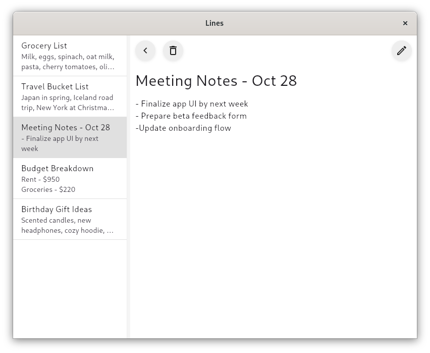

# Lines
Lines is a cross-platform notes app



## Getting started 
### Dependencies
- [Drift](https://pub.dev/packages/drift)
- [shared_preferences](https://pub.dev/packages/shared_preferences)

1. Clone the repo:
```bash 
git clone https://github.com/atomi19/lines.git
```

2. Navigate to the project directory:
```bash
cd lines
```

3. Get dependencies:
```bash
flutter pub get
```

4. Database setup (this will generate database.g.dart):
```
dart run build_runner build
```

5. Run the project on Linux, Windows or macOS
```
flutter run
```

## License
This project is licensed under the [MIT](LICENSE.txt) License